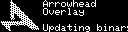
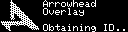
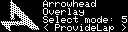
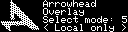
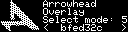
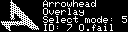
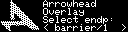
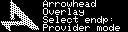
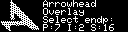

# Arrowhead Overlay for Raspberry Pi
_Making your system Arrowhead Compliant without touching the code._

Example of an application running around your program.


## Requirements
- `adafruit_circuitpython_ssd1305`
- `aclpy`: [GitHub](https://github.com/jara001/ah-acl-py)
- `python3-pil`
- `RPi.GPIO`


## Usage

1. Obtain certificates (`.p12`, `.pub`) for your system from your local Arrowhead Core.
2. Obtain also the certificate authority `.ca` for your cloud.
3. Create a configuration file `ahconf.py`.
4. Run the `overlay.py3`.


### Configuration example

```python
Server = ArrowheadServer(
    address = "192.168.1.22",
)

Interface = ArrowheadInterface(
    name = "HTTP-INSECURE-JSON",
)

Service = ArrowheadService(
    name = "scoreapp",
)

ProvidedService = ArrowheadService(
    name = "laptime",
    metadata = {
        "address": "192.168.12.22",
    },
)

Client = ArrowheadClient(
    name = "raspberry",
    address = "192.168.12.22",
    port = 10110,
    p12file = "raspberry.p12",
    p12pass = "SomeSecurePassword",
    cafile = "authority.ca",
    server = Server,
    interfaces = [Interface],
)
```

### Systemd service definition

The overlay is meant to run all the time on the Raspberry Pi. This can be acheived by creating a systemd service. An example of such configuration is shown below:

_Note: In the overlay we expect that the service restarts itself upon exiting the overlay. This behaviour is used for updating the code._

```
[Unit]
Description=Arrowhead Overlay for Optic Barrier
Wants=network-online.target
After=network.target network-online.target

[Service]
Type=simple
WorkingDirectory=/home/pi/ah-overlay
ExecStart=python3 overlay.py3
StandardOutput=inherit
StandardError=inherit
Restart=always
User=pi

[Install]
WantedBy=basic.target
```


## Controls

The overlay is controlled by three buttons:
- `OK` connected to GPIO 21,
- `LEFT` connected to GPIO 19,
- `RIGHT` connected to GPIO 26.


## Modes

The overlay currently works in three modes (selected by the user):
1. "FindServer" -- where it looks for a provider of `scoreapp` service,
2. "ProvideLap" -- where it register itself as a provider of `laptime` service,
3. "Local only" -- where it skips Arrowhead related stuff and runs without an active connection.


## Application behaviour

### Loading
Upon starting, the overlay loads all required libraries and creates necessary variables. During this, the screen shows loading status:


### Updating overlay
At first the overlay checks this repository for updates of the overlay. When changes are found, the repository is pulled and the overlay is restarted:


_Note: Actually, the application exits. We expect that it is restarted by the system itself._

### Updating barrier software
The same applies for repository of the barrier software. Upon finding new commits, the barrier application is rebuilt and the resulting binary is moved to an appropriate location:





_Note: In case that anything fails, following screen is shown before restart. As a design by-product, the building phase is not attempted again unless a new update is found._


### Arrowhead Discovery
Afterwards the overlay tries to communicate with Arrowhead Core, obtaining its system ID:



Upon success, received system ID is briefly shown:


On the other hand, when this step fails, it is displayed to the user and the overlay starts the "Local only" mode of the barrier:


### Main Menu
In case that ID is successfully received from Arrowhead Core, main menu is shown. Here, the user can select operation mode using `LEFT` and `RIGHT` buttons, confirming the choice with `OK` button:






_Note: The last menu item shows the short hash of current git commit._

In its default state the overlay automatically selects the first displayed menu item in 5 seconds. This countdown is stopped upon pressing one of the buttons, hiding the remaining time:


#### Find Server
When "FindServer" mode is selected, the overlay tries to find appropriate providers using orchestration mechanism in the Arrowhead Core. This is indicated by the following screen:


Orchestration is repeated every 5 seconds. In case that orchestration fails (i.e., the overlay is unable to communicate with Orchestrator), a screen with overlay's system ID and 'O.fail' is shown:



Upon receiving valid provider, barrier software is launched with websocat that sends lap time to the remote server.

_Note: It is possible to turn into the "Local only" mode by holding the `RIGHT` button._

##### Multiple providers
When multiple providers are received using orchestration a small menu is shown for the user to select one:


The controls are the same as for the main menu.

##### Multiple endpoints
When multiple endpoints on the selected provider are found, another menu is shown:



The controls are again the same as for the main menu.

#### Provide Lap time
When "ProvideLap" mode is selected, the overlay register itself to the Arrowhead Core as service provider:



When successful, IDs of the overlay, service and selected interface are shown:



Upon pressing `OK` button, the barrier software is launched. As an active connection is required to start the software, it is temporarily launched locally. Meantime, the following screen is shown:


_Note: This active connection is a limitation of the used websocat. It is not possible to launch the application right away._

### Exiting the overlay
When the overlay exits, it removes itself from the Arrowhead service providers (if registered). Before turning self off, the overlay shows a simple bye:


Afterwards, the screen is cleared.
